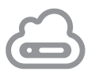

# Welcome to Vorteil

Below you can see each component of the Vorteil stack and how they are used.

>Vorteil Commandline Interface (VCLI)

Developers can use the VCLI to build apps directly into virtual machine images using Vorteil OS. VCLI is available for Windows, MacOS, and Linux, so your developers can get up and running no matter what desktop environment they prefer to work in.

>Virtual Machine Vorteil OS

Vorteil OS is the engine behind the scenes, running your apps quickly, securely, and efficiently. Vorteil OS has been written from scratch to provide only the functionality your apps need to run using a microservices architecture, so there’s the absolute minimal resource and administration overheads.

>Cluster Vorteil Management Server (VMS) and the Private Cloud

VMS is used to deploy and manage your fleet of Vorteil machines, including capabilities for app repositories to help you keep on top of updates to your code. VMS can be used to deploy the machines to your existing investment in your private hypervisor environment.

>Cloud Vorteil Management Server (VMS) and the Public Cloud

 VMS can also be used to manage a fleet of Vorteil machines in the public cloud, with released support for Google Cloud Platform, with AWS, Microsoft Azure, and other major players coming soon. Alternatively, we can manage your fleet for you using our Vorteil as a Service offering.
